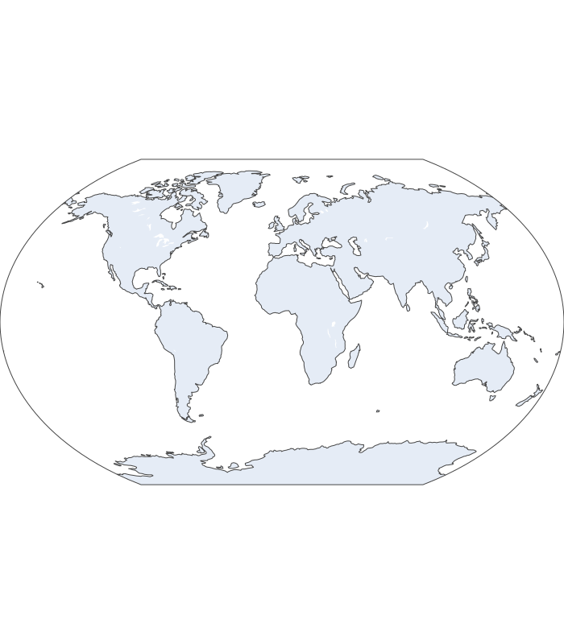

# Projection Samples
[equirectangular](#equirectangular) | [mercator](#mercator) | [orthographic](#orthographic) | [natural earth](#natural-earth) | [kavrayskiy7](#kavrayskiy7) | [miller](#miller) | [robinson](#robinson) | [eckert4](#eckert4) | [azimuthal equal area](#azimuthal-equal-area) | [azimuthal equidistant](#azimuthal-equidistant) | [conic equal area](#conic-equal-area) | [conic conformal](#conic-conformal) | [conic equidistant](#conic-equidistant) | [gnomonic](#gnomonic) | [stereographic](#stereographic) | [mollweide](#mollweide) | [hammer](#hammer) | [transverse mercator](#transverse-mercator) | [albers usa](#albers-usa) | [winkel tripel](#winkel-tripel) | [aitoff](#aitoff) | [sinusoidal](#sinusoidal)

## equirectangular

## mercator

## orthographic

## natural earth

## kavrayskiy7

## miller

## robinson

## eckert4

## azimuthal equal area

## azimuthal equidistant

## conic equal area

## conic conformal

## conic equidistant

## gnomonic

## stereographic

## mollweide

## hammer

## transverse mercator

## albers usa

## winkel tripel

## aitoff

## sinusoidal
